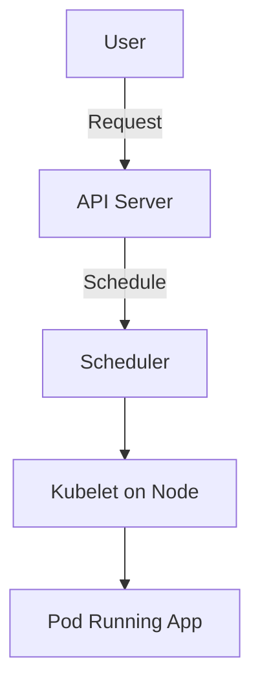
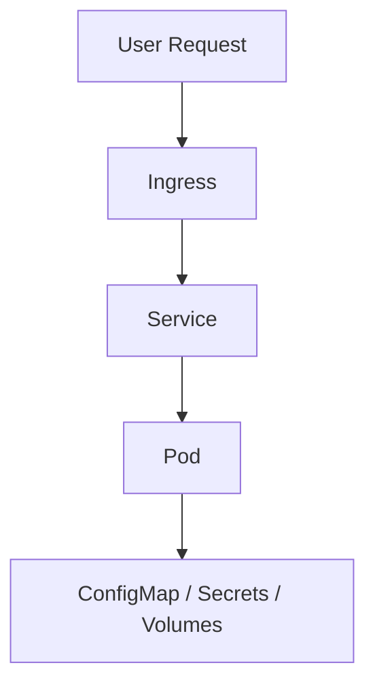
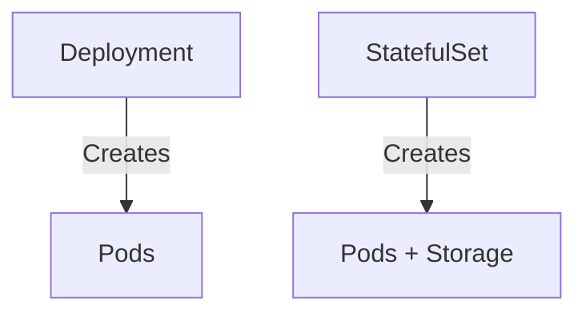
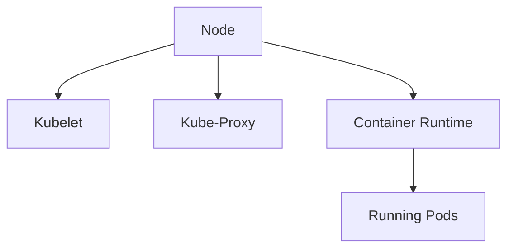
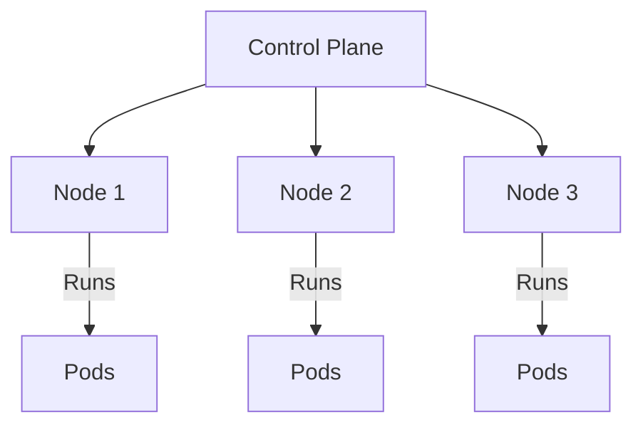
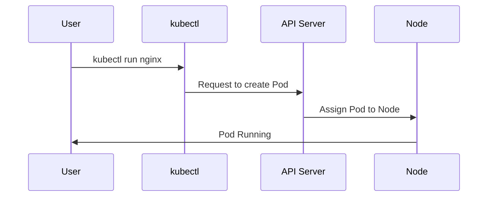
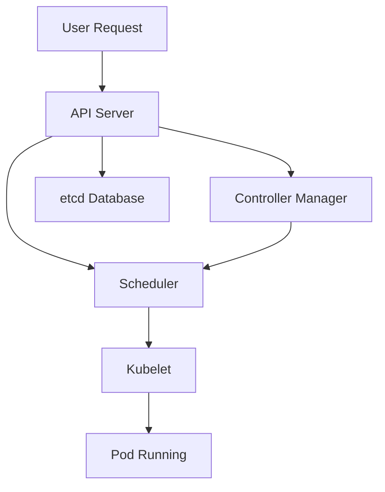

# Kubernetes fundamentals

---

## 1. What is Kubernetes?

Kubernetes (often called **K8s**) is like the **manager of a big computer system**.  
It takes care of apps so that they always run, even if one part of the system fails.

- **How it works:**  
  - It runs apps inside **containers** (tiny boxes that package apps).  
  - It makes sure apps are running correctly, restarts them if they crash, and can run them on different machines.  

- **Why it’s important to learn:**  
  - Almost every big company uses it (Google, Netflix, TikTok).  
  - It’s the modern way to keep apps **always available**, **scalable**, and **automatic**.  
  - If you want to work in DevOps, Cloud, or Software Engineering → Kubernetes is essential.



---

## 2. Key Concepts: Pods, Services, Ingress, ConfigMap, Volumes, Secrets

### Pod
- The **smallest unit** in Kubernetes.  
- Holds **1 or more containers**.  

### Service
- A **stable address** to reach Pods.  

### Ingress
- A **gateway from the internet** into your cluster.  

### ConfigMap
- Stores **settings** (not secret).  

### Volumes
- Storage that Pods can use.  

### Secrets
- For **sensitive data** (passwords, API keys).  



---

## 3. Running Applications

### Deployment (Stateless Apps)
- For apps that don’t need memory of the past (e.g., web server).  

### StatefulSet (Stateful Apps)
- For apps that **must remember data** (e.g., databases).  



---

## 4. Node Processes (on each worker machine)

- **Kubelet** → Ensures Pods are running.  
- **Kube-Proxy** → Handles networking.  
- **Container Runtime** → Actually runs containers (like Docker).  



---

## 5. How Everything Works Together

- A **Cluster** = many worker machines (Nodes).  
- Each Node runs Pods.  
- Control plane (masters) tells Nodes what to do.  



---

## 6. How to Interact with a Cluster

We use **kubectl** (command-line tool).

- **Schedule a Pod**  
  ```bash
  kubectl run nginx --image=nginx
  ```

- **Monitor Pods**  
  ```bash
  kubectl get pods
  kubectl describe pod <pod-name>
  ```

- **Reschedule / Restart Pod**  
  ```bash
  kubectl delete pod <pod-name>
  ```



---

## 7. The Master Processes (Control Plane)

- **API Server**  
  Receives and validates requests.  

- **Scheduler**  
  Decides where Pods run.  

- **Controller Manager**  
  Watches the cluster and heals it.  

- **etcd**  
  Stores all cluster data (the brain).  



---

# 📌 Summary
Kubernetes is like a giant automatic system that:
- Runs apps in containers  
- Keeps them alive  
- Scales them up or down  
- Makes sure users can always connect  

And it does all this **without you manually babysitting servers**.
